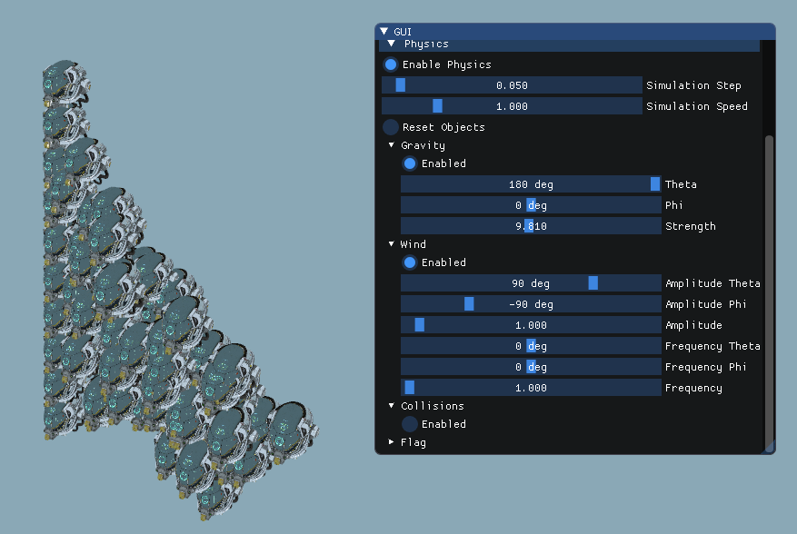
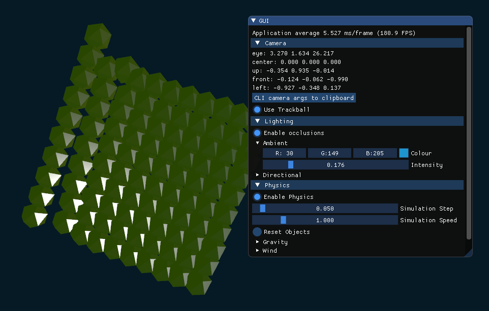

### Simulation physique

##### ESIPE-IMAC 3, UGE

### Projet

#### 30 avril 2021

----

### Info importantes

-  La bonne version du travail se trouve dans la branche `dev_physics`.
- Le code source de la simulation physique est dans `third-party/cantina-common/include/cant/physics` (en-têtes) et `third-party/cantina-common/inline/cant/physics` (implémentation).

### Prolongation choisie

- Collision entre particules :
les particules composant le drapeau sont représentées par des sphères, et peuvent s'entrechoquer (modèle de dynamique inverse).
- Les paramètres suivants peuvent être contrôlés dans l'interface :
   - physique (intervalle de mise à jour et échelle de temps),
   - gravité et vent (direction et amplitude),
   - drapeau (constante de rigidité, longueur à vide).

### Problèmes et limites

- Le calcul des collisions sont instables et ne fonctionnent pas correctement, parce que les corrections de vélocité sont faits après les inter-pénétrations.

### Captures d'écran

### Compilation

Depuis la racine du projet :

    git checkout -b dev_physics origin/dev_physics
    git checkout dev_physics
    mkdir build
    cd build
    cmake ..
    make  

### Exécution

Depuis la racine du projet :

    build/bin/gltf-viewer viewer samples/Sphere/glTF/Sphere.gltf

ou bien:

    build/bin/gltf-viewer viewer samples/DamagedHelmet/glTF/DamagedHelmet.gltf
